# Engineering Workflow

A repeatable, issue-driven workflow for building future projects with humans and coding agents. Work is specified before implementation, delivered in small branches, reviewed against both standards and intent, then merged into a stable `main` branch.

```mermaid
flowchart LR
    A[Idea or request] --> B{Clear enough?}
    B -- No --> C[Research, prototype, or grill]
    C --> D[Write specification]
    B -- Yes --> D
    D --> E[Create GitHub issue]
    E --> F[Split into ordered tickets]
    F --> G[Claim next unblocked ticket]
    G --> H[Create focused branch]
    H --> I[Test and implement]
    I --> J[Commit and push]
    J --> K[Open pull request]
    K --> L[Review standards and spec]
    L --> M{Tests and review pass?}
    M -- No --> I
    M -- Yes --> N[Squash merge to main]
    N --> O[Close issue and delete branch]
```



## Workflow

1. **Shape the work** — clarify uncertainty with `/research`, `/prototype`, or `/grill-with-docs`. Use `/ask-matt` when unsure which flow fits.
2. **Specify** — use `/to-spec` for one deliverable or `/to-tickets` for ordered tracer-bullet work. Each deliverable becomes a GitHub Issue.
3. **Triage external requests** — run `/triage` only on incoming issues. Agent-created tickets are already prepared.
4. **Implement** — claim the next unblocked ticket, create a fresh branch, and run `/implement`. Prefer behavior-first tests and focused commits.
5. **Review** — push, open a pull request, then run `/code-review main`. Fix standards or specification findings on the same branch.
6. **Merge** — merge only after tests and review pass. Squash into `main`, close the issue, and delete the branch.

## Core rules

- Keep `main` stable and demo-ready.
- One independently deliverable issue, branch, and pull request at a time.
- Merge blockers before dependent tickets.
- Use `Refs #<issue>` in a branch commit and `Closes #<issue>` in the pull request.
- Test observable behavior; run focused checks during development and the full suite before merge.
- Record durable domain language in `CONTEXT.md` and decisions in `docs/adr/` when needed.
- Preserve required AI co-author and session trailers.

## Branch names

```text
feature/12-streaming-chat
fix/19-login-error
docs/23-api-guide
chore/27-update-tooling
```

## Repository guide

- [`CONTRIBUTING.md`](CONTRIBUTING.md) — complete branch, implementation, review, and merge policy.
- [`AGENTS.md`](AGENTS.md) — agent behavior and attribution requirements.
- [`docs/agents/issue-tracker.md`](docs/agents/issue-tracker.md) — GitHub Issue operations and wayfinding.
- [`docs/agents/triage-labels.md`](docs/agents/triage-labels.md) — issue-state vocabulary.
- [`docs/agents/domain.md`](docs/agents/domain.md) — domain context and ADR conventions.
